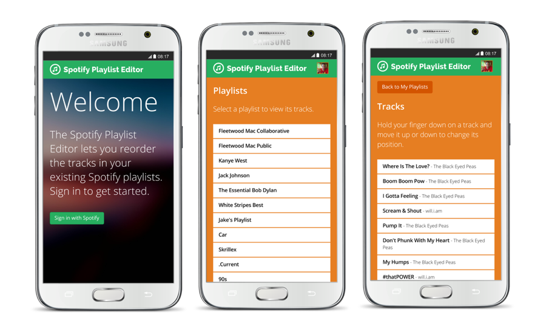

```NOTE: This repository is not actively maintained```

# Spotify Playlist Editor

The Spotify Playlist Editor is a node.js web application that allows Spotify users to rearrange tracks in their playlists online.

Currently hosted at [www.playlisteditor.com](http://www.playlisteditor.com)



### But why?
When this app was created, the Android Spotify app didn't provide a feature for users to reorder tracks in their playlists - it needed to be carried out on the desktop application or iOS app. As of mid-2018, the feature was finally added to the Android app.

## Configuration

Log in to [Spotify Developer](https://developer.spotify.com/) and create an application.

Modify the following part of the index.js file to include the client ID and client secret of your application on Spotify Developer.

```
var client_id = 'CLIENT_ID_GOES_HERE'; // Your client id
var client_secret = 'CLIENT_SECRET_GOES_HERE'; // Your client secret
```

Once you have deployed your application, take a note of the URL and update the following part of the app.js file:

```
var redirect_uri = 'https://www.DEPLOYED_APP.com/callback';
```

Remember, OAuth requires that callback URLs are hosted using SSL, so ensure that you specify an "HTTPS" URL.

Make sure you then configure the same callback URL against your application at [Spotify Developer](https://developer.spotify.com/).

## Credits

Thanks to heroku/node-js-getting-started, spotify/web-api-auth-examples and the [OpenShift 'nodejs' cartridge](http://openshift.github.io/documentation/oo_cartridge_guide.html#nodejs)for the vast majority of this code.

and thelinmichael/spotify-web-api-node
